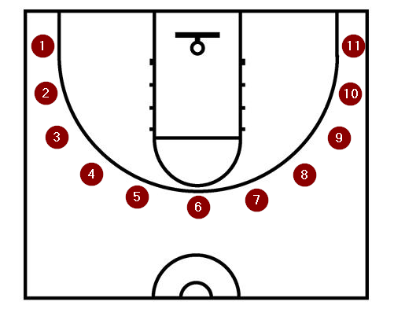

# Shooting Insights

Shooting Insights provides basketball shooting analytics. The data is obtained from three point shooting drill practice sessions. The primary data points are shots made and the temperature during the drill. 

## App Structure
The Application consists of 4 parts.

### 1. Bootstrap
Bootstrap builds the app. It creates cloud services and tells them to play nicely with one another. Terraform is the primary tool used for this.

### 2. Collection
Collection feeds data into the app. The entry point is a Google form. The user inputs the results of their shooting drill. This includes the shots made from each location and the current temperature. Submission of the form kicks off a serverless app flow to store the data in AWS S3 for further processing.

### 3. Processing
The collection step results in raw json objects stored in s3. Each POST to the api gateway results in an individual json object. Processing runs Athena queries against the json files. Additional workloads and services can be utilized in this step as needed.

### 4. Analytics
TBD. 

## Using the app

1. Attempt 4 shots from each of 11 spots behind the three point line. Enter the number of shots made from each spot. Submit the results via the Google Form. The Google form has 12 short answer questions. The first 11 questions are to record the number of shots made from each spot. The last question is to record the current temperature. The temperature is in Farenheit.

 - Form data validation
   - questions 1-11: integer between 0-4
   - question 12: integer between -150 and 150
 - Shooting locations

      

2. Form submission triggers the collection app flow.

 - TODO: create a diagram of a form submission 
 - Google Form Submit => Google Trigger => Google Apps Script HTTP POST (node.js) => Amazon API Gateway => AWS Lambda (python)
