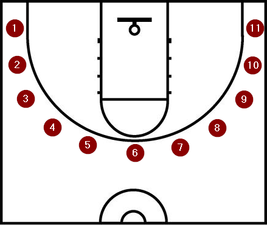
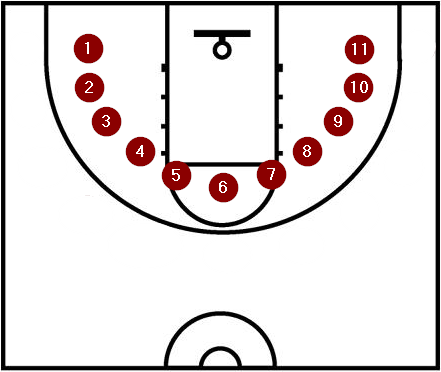
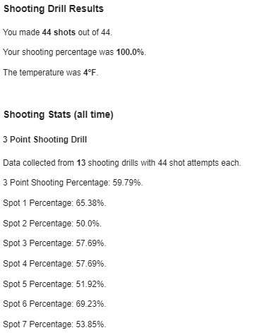

# Basketball Drill Bot :basketball:

Basketball Drill Bot measures basketball shooting drill results over time.

## Architecture :building_construction:
- Event-driven and decoupled with event handling performed via microservices
- Serverless with flexible data stores

## Tech Toolbox :toolbox:
- Terraform
- API Gateway, Lambda, DyanmoDB, S3, Athena, Glue, Simple Email Service, IAM
- Hashicorp Configuration Language (HCL), Python, Node.js
- Google Forms

## Application Flow
1. The user submits a Google Form containing the results from the shooting drill.
2. The form submit event triggers a Google Apps Script that makes an HTTP post to the API Gateway.
3. The API Gateway receives the HTTP post and triggers the collection Lambda Function.
4. The collection Lambda Function stores the post data and triggers the setup_processing Lambda Function.
5. The setup_processing Lambda Function starts execution of an Athena Query.
6. The Athena Query results file creation invokes the processing Lambda Function (via bucket notification).
7. The processing Lambda Function starts execution of an Athena Query.
8. The Athena Query results file creation invokes the response Lambda Function (via bucket notification).
9. The response Lambda Function formats the data into an email, sends it, and invokes the cleanup Lambda Function.
10. The cleanup Lambda Function runs to remove temp files.

## Terraform Modules
 - **Bootstrap** creates the foundational cloud resources.
 - **Collection** feeds data into the app. The entry point is a Google form. The user inputs the results of their shooting drill. This includes the shots made from each location and the current temperature. Submission of the form kicks off a serverless app flow to store the data in AWS S3 for further processing.
 - **Processing** draws insight from the data. The collection step results in raw json objects stored in s3. Each POST to the api gateway results in an individual json object being stored. Processing runs queries against these json files. When complete, it triggers the response step.
 - **Response** emails the results to the user.
 - **Cleanup** deletes temporary files created during runtime.

## Functionality
Basketball Drill Bot currently supports three point and mid range shooting drill submissions. Each drill involves attempting 4 shots from each of 11 locations. Each drill correlates to an API route such as 

https://AWS-Generated-ID.execute-api.AWS-Region.amazonaws.com/threepoint

or 

https://AWS-Generated-ID.execute-api.AWS-Region.amazonaws.com/midrange

### Three Point

### Mid Range

The result of a google form submission is an email containing results of the submitted drill as well as the combined percentages of all previous drill submissions of the same type.

